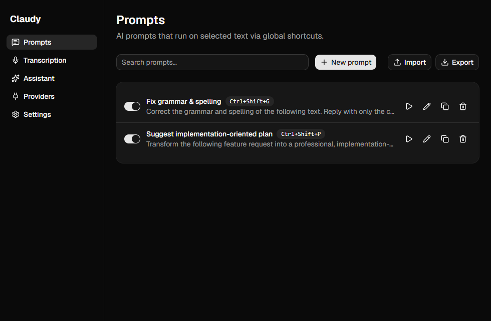
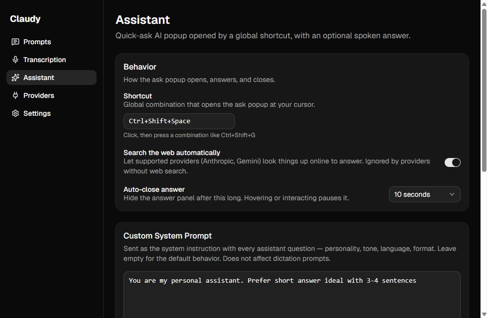
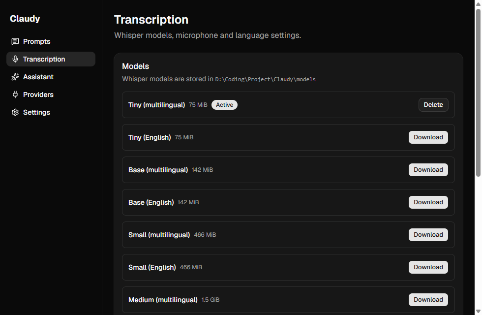
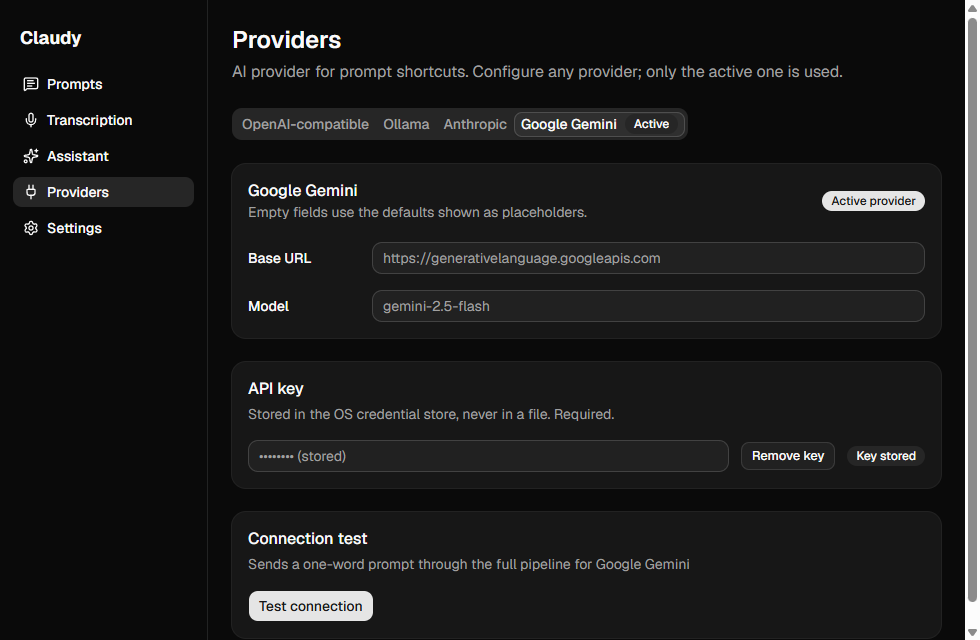

<p align="center">
  
</p>

<h1 align="center">Claudy</h1>

<p align="center"><b>Talk, select, ask — Claudy brings voice typing and AI help to every app on your computer, and keeps your data private.</b></p>

Claudy sits quietly in your system tray. Press a keyboard shortcut in any application and it can:

- **Type what you say** — your speech is turned into text on your own computer and typed into whatever app you're using. Your voice never goes online.
- **Rewrite selected text with AI** — create your own shortcuts like "fix grammar" or "make this shorter". Select text anywhere, press the shortcut, and the result is copied to your clipboard. Your original text is never replaced.
- **Answer your questions** — a small ask box opens right at your cursor. The answer appears in a floating panel and can be read aloud by a natural-sounding voice that runs on your machine.

Built with Tauri 2 and React. Windows-first — macOS and Linux code paths exist but are untested.

## Screenshots

| Prompts | Assistant |
| --- | --- |
|  |  |

| Transcription | Providers |
| --- | --- |
|  |  |

## Features

### Voice dictation
- Press `Ctrl+Shift+D` (changeable) in any app to start and stop talking; a small on-screen pill shows when you're recording
- Everything happens on your computer (whisper.cpp) — audio is kept in memory only, never saved to disk or sent anywhere
- Download speech models inside the app, with progress bars and file checks; remove them anytime
- Choose your microphone and try it out with the built-in test recorder

### AI prompt shortcuts
- Create prompts with their own global shortcuts. Templates can include `{{selected_text}}`, `{{clipboard}}`, `{{date}}`, and `{{time}}`
- Works on text you select in any application: press the shortcut, and the finished result lands on your clipboard with a notification (pasting it for you is optional and off by default)
- Manage prompts easily: search, turn on or off, run, delete, and share them as JSON files
- Choose your AI service: **Anthropic**, **OpenAI-compatible** (OpenAI, Groq, and others), **Google Gemini**, or **Ollama** (runs on your machine)
- API keys are kept in your operating system's secure credential store — never written to a config file

### Quick-ask voice assistant
- Press `Ctrl+Shift+Space` (changeable) and an ask box opens at your cursor
- Answers appear in a floating panel: copy them, ask a follow-up, replay the voice, or let the panel close on its own
- Answers can be spoken aloud by a local voice (Kokoro, ~115 MB download) — works fully offline, with a choice of voices, speed, and volume
- Give the assistant standing instructions with a **custom system prompt** — set its tone, language, or answer style once and it applies to every question
- Services that support it can also search the web to answer (Anthropic, Gemini); others simply skip it
- If the voice model is missing or speech fails, you still get the written answer with a short note

### App
- Lives in the system tray; closing the window hides the app instead of quitting it
- Settings for shortcuts (with a recorder and conflict warnings), light/dark theme, starting with Windows, and auto-paste
- You always get a notification telling you what happened — nothing fails silently

## Getting started

### Prerequisites (Windows)

- Node.js ≥ 20
- Rust (MSVC toolchain) ≥ 1.77
- Visual Studio Build Tools 2022 with the Desktop C++ workload
- CMake and LLVM (required by whisper-rs) — set `LIBCLANG_PATH=C:\Program Files\LLVM\bin`

See [docs/BUILDING.md](docs/BUILDING.md) for full setup details, macOS/Linux prerequisites, and platform limitations.

### Development

```sh
npm install
npm run tauri dev
```

### Release build

```sh
npm run tauri build
```

Produces a per-user NSIS installer (no admin prompt) at `src-tauri/target/release/bundle/nsis/Claudy_<version>_x64-setup.exe`. The installer is unsigned, so Windows SmartScreen will warn on first run.

After installing, download a Whisper model from the Transcription page before using dictation. Models are stored locally in the project `models/` directory.

## Tech stack

- **Frontend:** React 19, TypeScript, Vite 7, Tailwind CSS v4, shadcn/ui + Radix UI, Zustand
- **Shell:** Tauri 2 (global-shortcut, clipboard-manager, notification, autostart, store, single-instance plugins)
- **Rust core:** whisper-rs (STT), kokoro-tts + ort/ONNX Runtime (local TTS), cpal (audio capture) + rodio (playback), enigo (input simulation), keyring (secrets), reqwest + tokio (AI providers)

## Project layout

```
src/                React UI (pages, components, Tauri API bridges in src/lib)
src-tauri/src/      Rust core: audio, stt, models, shortcuts, selection,
                    inject, prompts, prompt_flow, tray, overlay, assistant,
                    ai/ providers, tts/ (kokoro engine + playback)
branding/           Logo assets
docs/BUILDING.md    Platform build instructions
docs/screenshots/   README screenshots
docs/superpowers/   Design spec and phase-by-phase implementation plans
models/             Locally downloaded Whisper models (gitignored)
```

## Privacy

- Zero telemetry
- Dictation audio is processed in-memory and never leaves your machine
- API keys live only in the OS credential store
- Selected text is sent only to the AI provider you configured, only when you trigger a prompt

## Documentation

- [Building & platform notes](docs/BUILDING.md)
- [Design spec](docs/superpowers/specs/2026-07-12-claudy-ai-assistant-design.md)
- Implementation plans: `docs/superpowers/plans/`

## Acknowledgements

Claudy is inspired by [Handy](https://github.com/cjpais/Handy), the open-source offline speech-to-text app.

## License

[MIT](LICENSE)
